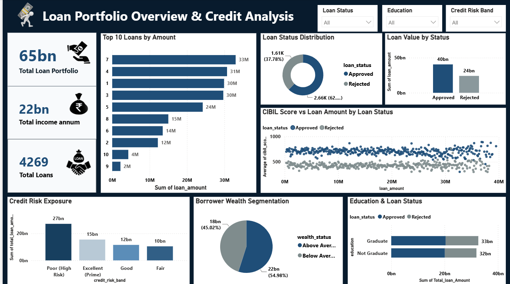
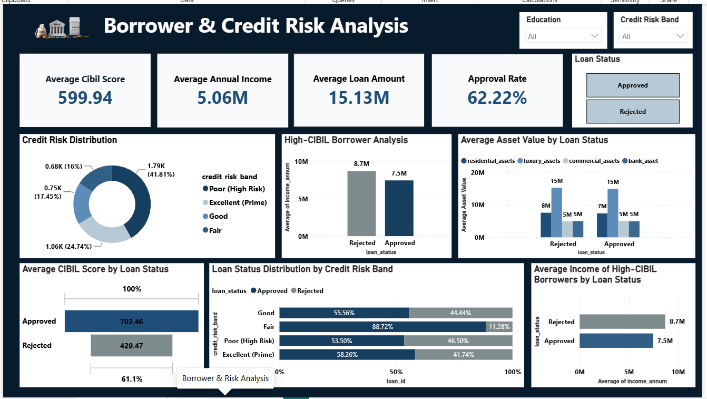

# Loan Credit Risk Analytics

An end-to-end loan analytics project built to analyze loan applications, borrower financial profiles, credit risk, loan exposure, and approval patterns using Microsoft Azure, PySpark, SQL, and Power BI.

---

## 📌 Project Overview

This project takes a raw loan approval dataset and transforms it into an analytical solution using cloud data engineering and business intelligence technologies.

The complete workflow includes:

**Kaggle Dataset → Azure Storage → Azure Databricks → PySpark Transformation → Delta Lake → Azure SQL Database → SQL Views → Power BI**

Azure Data Factory is used to orchestrate the data processing workflow.

The project focuses on understanding borrower characteristics, credit risk, loan amounts, financial assets, and loan approval patterns.

---

## 🎯 Business Objectives

The main objectives of this project are to:

- Analyze loan application and approval patterns
- Understand credit risk across different borrower segments
- Analyze the relationship between CIBIL score and loan amount
- Identify high-CIBIL and high-income borrowers
- Analyze loan exposure across credit risk bands
- Compare loan status across education categories
- Analyze borrower wealth segmentation
- Identify top loan exposures
- Analyze running loan totals and moving averages
- Build an interactive Power BI dashboard for business analysis

---

# 🏗️ Data Architecture

```text
                         Kaggle Dataset
                              │
                              ▼
                    ┌───────────────────┐
                    │   Azure Storage   │
                    │     Container     │
                    └─────────┬─────────┘
                              │
                              ▼
                    ┌───────────────────┐
                    │ Azure Databricks  │
                    │     PySpark       │
                    │                   │
                    │ Data Cleaning     │
                    │ Feature Engineering│
                    │ Risk Classification│
                    └─────────┬─────────┘
                              │
                              ▼
                    ┌───────────────────┐
                    │    Delta Lake     │
                    │ Transformed Data  │
                    └─────────┬─────────┘
                              │
                              ▼
                    ┌───────────────────┐
                    │   Azure SQL DB    │
                    │                   │
                    │ Clean Loan Data   │
                    └─────────┬─────────┘
                              │
                              ▼
                    ┌───────────────────┐
                    │    SQL Views      │
                    │                   │
                    │ Portfolio Analysis│
                    │ Risk Analysis     │
                    │ Borrower Analysis │
                    └─────────┬─────────┘
                              │
                              ▼
                    ┌───────────────────┐
                    │     Power BI      │
                    │    Dashboards     │
                    └───────────────────┘


              Azure Data Factory
                      │
                      ▼
             Pipeline Orchestration

🔄 Data Pipeline
1. Dataset
The project starts with a loan approval dataset obtained from Kaggle in CSV format.
The raw CSV file was uploaded to an Azure Storage container.

2. Azure Storage
Azure Storage was used as the initial storage layer for the raw dataset.
The dataset was stored in the Azure Storage container before processing it with Azure Databricks.

3. Azure Databricks & PySpark
Azure Databricks was used to process and transform the raw loan data using PySpark.
The transformation process included:

Cleaning column headers
Removing unnecessary spaces from string values
Creating total asset value
Creating Loan-to-Income ratio
Creating Loan-to-Asset ratio
Creating CIBIL-based credit risk bands
Creating a credit risk summary
Writing transformed data in Delta format

🧮 Feature Engineering
Several analytical features were created using PySpark.

Total Assets
Total Assets =
Residential Assets
+ Commercial Assets
+ Luxury Assets
+ Bank Assets

Loan-to-Income Ratio
LTI Ratio =
Loan Amount / Annual Income

Loan-to-Asset Ratio
LTV Ratio =
Loan Amount / Total Assets
These features were created to provide additional measures of borrower financial strength and loan exposure.

📊 Credit Risk Classification
A credit risk band was created based on the borrower's CIBIL score.
CIBIL Score	Credit Risk Band
750 and above	  Excellent (Prime)
650–749	        Good
550–649	        Fair
Below 550	      Poor (High Risk)
This classification was then used in the SQL analysis and Power BI dashboard.

🗄️ Delta Lake
After transformation, the processed loan data and risk summary were written to Azure Storage in Delta format.
This created a transformed data layer that could be used for downstream analysis.

🔗 Azure SQL Database
The transformed data was loaded into Azure SQL Database.
Azure SQL was used as the analytical data layer for creating SQL views and preparing data for Power BI.

🔍 SQL Analysis
Multiple analytical views were created in Azure SQL Database.

The project contains the following SQL views:
1. vw_overall_portfolio_summary
2. vw_loan_status_breakdown
3. vw_credit_risk_exposure
4. vw_Avg_income_High_Cibil
5. vw_education_status_analysis
6. vw_wealth_segmentation
7. vw_loan_running_totals
8. vw_top_10_loans
9. vw_top_ranked_loans_by_education
10.loan_analysis

💻 SQL Techniques Used
The SQL analysis demonstrates several SQL concepts, including:
COUNT()
SUM()
AVG()
CASE WHEN
Subqueries
CTEs
Window functions
Running totals
Moving averages
DENSE_RANK()
PARTITION BY
Aggregation and grouping
Conditional segmentation

🔄 Azure Data Factory
Azure Data Factory was connected with Azure Databricks using linked services.
The purpose of the Data Factory workflow is to orchestrate the data processing process and provide a foundation for scheduling or triggering the Databricks transformation workflow.

📈 Power BI Dashboard
The transformed and analytical data was connected to Power BI from Azure SQL Database.
The Power BI report contains two pages.

Page 1 — Loan Portfolio Overview
The first dashboard page provides an overview of the loan portfolio and credit profile.
Key analysis includes:
Total Loan Portfolio
Total Income
Total Loans
Top 10 Loans by Amount
Loan Status Distribution
Loan Value by Status
CIBIL Score vs Loan Amount
Credit Risk Exposure
Borrower Wealth Segmentation
Education and Loan Status Analysis

###  Dashboard


Page 2 — Borrower & Credit Risk Analysis
The second dashboard page focuses on borrower characteristics and credit risk.
Key analysis includes:
Average CIBIL Score
Average Annual Income
Average Loan Amount
Approval Rate
Credit Risk Distribution
High-CIBIL Borrower Analysis
Asset Value Analysis
Average CIBIL Score by Loan Status
Loan Status by Credit Risk Band
High-CIBIL Borrower Income by Loan Status

Dashboard


